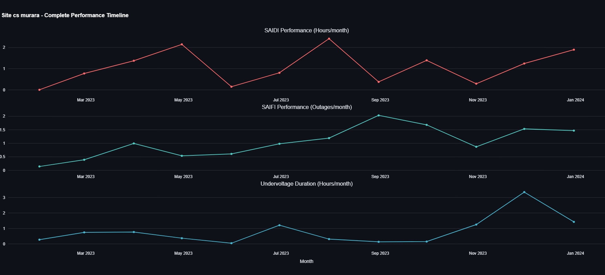

```markdown
<div align="center">

#  QA-RBF Mini-Grid Dashboard 

###  Results-Based Financing for Mini-Grid Excellence

[](https://jack-khalif-rbf-minigrid-dashboard-app-xyjpez.streamlit.app/)
[](https://streamlit.io/)
[](https://python.org/)
[](LICENSE)

[ **Live Dashboard**](https://jack-khalif-rbf-minigrid-dashboard-app-xyjpez.streamlit.app/) | [**Documentation**](#-features) | [ **Quick Start**](#-installation--setup) | [ **Contributing**](#-contributing)

---

### *Transforming Mini-Grid Performance Data into Smart Financial Incentives*

</div>

##  **Project Overview**

The **QA-RBF Mini-Grid Dashboard** revolutionizes how mini-grid projects are financed and monitored in developing regions. By implementing a sophisticated **3-Stage Payment Model** combined with **adaptive percentile-based benchmarking**, this dashboard ensures that funding flows are directly tied to both infrastructure deployment and sustained service quality.

###  **Key Problems Solved**

| Challenge | Solution |
|-----------|----------|
|  **Lack of Performance Accountability** | 3-stage payments tied to connections + service quality |
|  **Inflexible Benchmarking** | Adaptive percentile thresholds that evolve with data |
|  **Complex Payment Calculations** | Automated multi-stage payout computation |
|  **Limited Stakeholder Transparency** | Interactive visualizations for all stakeholders |
|  **One-size-fits-all Approaches** | Context-sensitive performance zones |

---

##  **Features**

###  **3-Stage Payment Model**
- ** Stage 1 (30%)**: Connection-based milestone payments with percentage thresholds
- **Stage 2 (50%)**: Quality assessment after 3-month monitoring period  
- **Stage 3 (20%)**: Sustained performance verification after 6 months

### **Adaptive Performance Benchmarking**
- **Dynamic Thresholds**: Automatically adjusts to sector performance evolution
- **Performance Zones**: Bonus (>95th percentile) | Standard (90th-95th) | Penalty (<90th)
- ** Manual Overrides**: Accountable threshold adjustments for exceptional circumstances

###  **Multi-Metric Performance Analysis**
- ** SAIDI**: System Average Interruption Duration Index (50% weight)
- **SAIFI**: System Average Interruption Frequency Index (30% weight)  
- ** Undervoltage**: Power quality monitoring (20% weight)

---

## **Dashboard Screenshots**

###  **Main Dashboard Overview**
*[Upload your main dashboard screenshot here]*


###  **Performance Analytics**
*[Upload your performance visualizations here]*


### **Sunburst Visualization**
*[Upload your sunburst chart screenshot here]*


###  **Site Drilldown Analysis**
*[Upload your site drilldown screenshot here]*



### **Performance vs Payouts**
*[Upload your performance vs payouts charts here]*


---

## **Technical Architecture**

<div align="center">

```
graph TD
    A[ CSV Data Files] --> B[ Data Preprocessing]
    B --> C[ Percentile Calculation]
    C --> D[ Performance Scoring]
    D --> E[ 3-Stage Payout Calculation]
    E --> F[ Interactive Visualizations]
    F --> G[ Export & Reporting]
    
    H[ User Controls] --> C
    H --> D
    H --> E
```

</div>

###  **Technology Stack**

| Component | Technology | Purpose |
|-----------|------------|---------|
|  **Frontend** | Streamlit | Interactive web application |
| **Visualization** | Plotly | Advanced charts and graphs |
|  **Backend** | Python | Data processing and calculations |
| **Data Analysis** | Pandas | Data manipulation and aggregation |
| **Calculations** | NumPy | Numerical computations |

---

##  **Key Performance Indicators**

###  **Financial Metrics**
- **Total Project Payouts** across all stages
- **Stage-wise Payment Breakdown** with performance multipliers
- **Connection-based vs Performance-based** payment allocation

###  **Technical Metrics**
- **SAIDI Average** across selected sites and timeframes
- **Performance Zone Distribution** (Bonus/Standard/Penalty)
- **Connection Completion Rates** relative to targets

###  **Comparative Analysis**
- **Best/Worst Performing Sites** by reliability metrics
- **Network-wide Performance Trends** over time
- **Minigrid-to-Minigrid Comparisons** via sunburst visualization

---


## **Data Requirements**

###  **Input Files Structure**

| File | Required Columns | Description |
|------|------------------|-------------|
| `DRC_minigrid_undervoltage_2023.csv` | `day`, `site_id`, `minigrid_name`, `undervoltage_duration` | Power quality data |
| `DRC_minigrid_saifi_2023.csv` | `day`, `site_id`, `minigrid_name`, `SAIFI` | Outage frequency data |
| `DRC_minigrid_saidi_2023.csv` | `day`, `site_id`, `minigrid_name`, `SAIDI` | Outage duration data |

###  **Data Specifications**
- ** Date Format**: YYYY-MM-DD (pandas parseable)
- ** Site Identifiers**: Consistent across all files
- ** Metrics**: Numeric values in appropriate units
- ** Coverage**: Complete temporal coverage preferred

---

## **Configuration Options**

###  **Payment Structure Customization**
```
stage_1_pct = 30  # Connection milestone percentage
stage_2_pct = 50  # Quality assessment percentage  
stage_3_pct = 20  # Sustained performance percentage (auto-calculated)
```

###  **Performance Thresholds**
```
p_standard_low = 0.90   # 90th percentile boundary (penalty threshold)
p_standard_high = 0.95  # 95th percentile boundary (standard threshold)
```

### **Connection Model**
```
connection_completion_pct = 70  # Percentage required for Stage 1
stage_1_cap = 0.30             # Maximum 30% of total project cost
```

---


##  **Future Roadmap**

###  **Planned Enhancements**

####  **Real-Time Integration**
- [ ] API connections to mini-grid monitoring systems
- [ ] Live SAIDI/SAIFI/undervoltage data streams
- [ ] Automatic dashboard updates

#### **Advanced Analytics**
- [ ] Machine learning for performance forecasting  
- [ ] Anomaly detection in performance patterns
- [ ] Predictive payout modeling

####  **Enhanced Accessibility**
- [ ] Mobile-responsive design
- [ ] Offline capability for field use
- [ ] Progressive Web App features

####  **Enterprise Features**
- [ ] User authentication and role-based access
- [ ] Multi-step approval workflows
- [ ] Enhanced audit trail capabilities

---


```


- 🚀 **Action-oriented** with clear calls-to-action and links

Just replace the image placeholders with your actual screenshots and update the GitHub links with your repository details!
